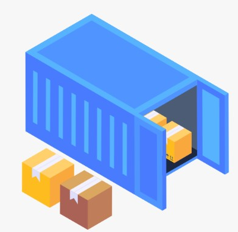

# Introduction to Containers

I'm excited to break down this complex topic into bite-sized chunks, using relatable examples and analogies to help you grasp the concept with ease.

## What's a Container, Anyway?

Imagine you're moving into a new apartment 🏠. You've got your furniture 🛋️, clothes, and kitchen utensils 🍳 all packed up in boxes 📦. Each box has everything you need to set up a specific part of your life – like a mini-kitchen or a cozy bedroom. That's exactly what a `container` does in the software world!

A container is a `self-contained package` that holds everything your application needs to run: the `code`, `dependencies`, `libraries`, and `settings`. It’s like a portable, mini-environment that ensures your app runs smoothly, no matter where it’s deployed, without having to worry about the underlying system.

Containers simplify the deployment and management of applications, making them an essential part of modern software development.

## The Magic of Containers ✨

So, what makes containers so special? Here are a few key benefits:

- **Lightweight** 🪶: Containers are like featherlight backpacks, carrying only what's necessary for your app to run. No extra baggage!
- **Portable** 🌍: Containers are like travel-sized toiletries – they work anywhere, without needing special adapters or converters.
- **Isolated** 🛏️: Containers are like separate hotel rooms – each one has its own space, and what happens in one room doesn't affect the others.

## How Containers Work: A Peek Under the Hood 🔍

Here's a simplified overview of how containers work:

- **Image** 🖼️: Think of an image as a blueprint or a recipe for your container. It defines what's inside and how it should be built.
- **Container Runtime** 🚧: The container runtime is like a construction team that takes the blueprint and builds the container.
- **Container Instance** 🏡: The container instance is the actual, running container – like a fully furnished apartment, ready for you to move in!

## Why Containers Matter 💡

So, why are containers such a big deal? Here are a few reasons:

- **Easy Deployment** 🚀: Containers make it a breeze to deploy apps since they include everything needed to run.
- **Consistent Environment** 🛠️: Containers ensure a consistent environment, reducing errors and inconsistencies.
- **Efficient Resource Utilization** ⚡: Containers use fewer resources than virtual machines, making them more efficient.

## Containers vs. Virtualization: A Common Question 🤔

You might wonder, with virtualization in place, why do we need `containers`? The truth is, there's no one-size-fits-all answer. It all depends on your specific requirements, architectural decisions, and business goals.

Virtualization provides a complete, self-contained operating system environment, which can be resource-intensive.

Containers, on the other hand, `share the host system's kernel` and offer a `lightweight`, `isolated` environment for applications.

While virtualization is ideal for certain scenarios, containers provide a more efficient and scalable solution for many modern applications.

The good news is that `containers` and `virtualization` can work together seamlessly, allowing you to:

- **Maximize resource utilization** 💻
- **Reduce costs** 💰
- **Improve deployment efficiency** 🚀
- **Enhance overall system flexibility** 🔄

By leveraging both technologies, you can create a powerful, flexible approach to modern application deployment. Ultimately, the choice between virtualization and containers depends on your specific needs. Understanding the differences and benefits of each allows you to make informed decisions to optimize your infrastructure and application deployments.

## Further Reading 🔍

- [What is a Container? | Docker](https://www.docker.com/resources/what-container/)
