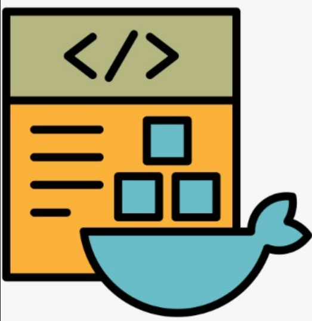

# Introduction to Docker 🐳

Let's talk about `Docker`, a game-changing technology that's revolutionized the way we develop, deploy, and run applications. Docker is a `containerization platform` that allows developers to package, ship, and run applications in a consistent and reliable way. This means you can write code on your laptop, deploy it to a cloud platform, and rest assured that it will work as expected—no more `it works on my machine!` surprises! 😊

Docker's importance in today's software development landscape can't be overstated. With its widespread adoption, `Docker` has become a standard tool in many organizations, enabling developers to work more efficiently, collaborate more effectively, and deploy applications more reliably. By using Docker, developers can focus on writing code, rather than worrying about the underlying infrastructure.

## Before Docker: The Problem Statement 😖

We've all been there—you've spent hours coding, testing, and perfecting your application, only to have it fail miserably when you deploy it to a different environment. The infamous `it works on my machine!` phrase has become a frustrating reality for many developers.

But why does this happen?

The root of the problem lies in `inconsistent environments`, `dependencies`, and `configurations`. Imagine you're working on a project with a team of developers, each with their own machine, operating system, and set of dependencies. It's a recipe for disaster! A small difference in environment can cause a perfectly functioning application to break, leading to hours of debugging and frustration.

For example, let's say you're working on a web application that uses a specific version of a library. You've tested it on your machine, and it works flawlessly. But when you deploy it to a production server, it suddenly stops working. After `hours` of `debugging`, you discover that the production server has a different version of the library installed. Sound familiar? 😩

These challenges have plagued developers for years, but Docker has changed the game. In the next section, we'll explore how Docker addresses these issues and makes application development, deployment, and management a whole lot easier.

## Why Docker Came into Existence 🛠️

In 2010, two frustrated developers, `Solomon Hykes` and `Sebastien Pahl`, set out to solve the infamous `it works on my machine!` problem. They founded Docker, inspired by the shipping industry, where standardized containers revolutionized global trade. They asked, `Why can't we do the same for software?`

Docker’s `mission` was simple: to create a solution that allows developers to package their applications, along with all dependencies, into a single, portable unit that can be easily deployed and managed across different environments. This approach would `eliminate` the `inconsistencies` and `dependency issues` that caused so much frustration.

## How Docker Solved the Problem 🚢

So, how did `Docker` solve this problem? By introducing `containerization!` Docker’s approach is both simple and powerful: package your application, its dependencies, and settings into a lightweight container that can be run anywhere. This container is like a shipping container on a cargo `ship—self-contained`, `portable`, and easily `moved` between `environments`.

### With Docker, You Get

- **Consistent and Reliable Environments** 🎯: Your application runs the same way everywhere, eliminating "it works on my machine!" surprises.
- **Easy Deployment and Scaling** 🚀: Deploy your application with a single command, and scale it up or down as needed.
- **Isolation and Security** 🔒: Each container runs in its own isolated environment, ensuring that your application is secure and won’t interfere with others.
- **Faster Development and Testing Cycles** ⚡: Docker’s lightweight containers spin up quickly, allowing you to test and iterate faster.

Think of it like this: with Docker, you can package your application into a container, and then `ship` it to any environment—`dev`, `test`, `prod`, or even the `cloud`. The container ensures that your application runs `consistently`, `every time`.

