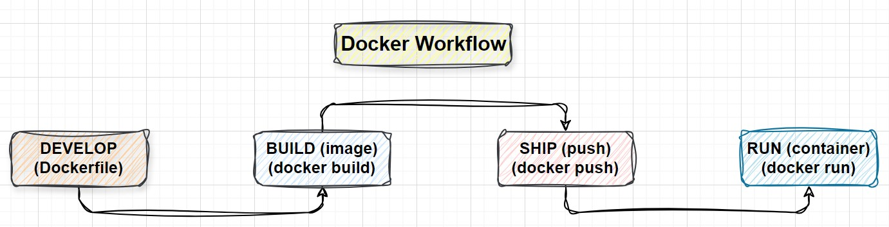

# 🚀 Docker Workflow: From Development to Deployment

Understanding Docker's workflow 🔄 is like learning to cook 🍳 your favorite recipe. Each step is crucial to achieving a successful outcome, whether you're developing locally or deploying to production. In this section, we'll break down Docker's workflow into simple, digestible steps, ensuring you can confidently use Docker in your projects.

Imagine you're a chef preparing a meal 🍽️. You gather your `ingredients` (`code` and `dependencies`), follow a `recipe` (`Dockerfile`), `cook` the dish (`build the image`), and then `serve` it (`run the container`). Docker's workflow follows a similar process, making it easy to develop, ship, and run your applications anywhere.

Let’s dive into each step of the `Docker workflow` and see how it all comes together to make your application development smooth and efficient.

## 🛠️ Docker Workflow: A Step-by-Step Guide

### 1. **Develop** 💻

**Real-World Analogy**: This step is like `planning` and `gathering` your `ingredients` before cooking. You need to know what you want to make and gather everything you need.

In the development phase, you write your application code and create a `Dockerfile`. The `Dockerfile` is a text file that contains `instructions` on how to build your Docker image. It specifies the `base image`, `dependencies`, `environment variables`, and `commands` to run your application.

### 2. **Build** 🛠️

**Real-World Analogy**: Building the Docker image is like cooking the meal. You follow the `recipe` `(Dockerfile)` to combine your `ingredients` `(code and dependencies)` into a `finished dish` `(Docker image)`.

After writing your Dockerfile, you use the `docker build` command to create a `Docker image`. The image is a `snapshot` of your application, including everything it needs to run, like a fully prepared meal ready to be served.

### 3. **Ship** 🚢

**Real-World Analogy**: Shipping the Docker image is like `packaging` your meal for delivery. You store it in a container that can be easily transported to wherever it's needed.

Once your image is built, you can push it to a `Docker registry`, like `Docker Hub`, using the `docker push` command. This makes your image available for others to pull and use or allows you to deploy it across different environments.

### 4. **Run** 🏃‍♂️

**Real-World Analogy**: Running the container is like `serving` the meal. The dish is ready, and now it's time to enjoy it.

Finally, you run your `Docker container` using the `docker run` command. The container is an isolated environment where your application runs, like a fully set dining table where the meal (`application`) is served and ready to be enjoyed.

## 🎉 Conclusion: Mastering the Docker Workflow

Understanding the Docker workflow is like unlocking a new level in your technology journey. By mastering the steps of `Develop`, `Build`, `Ship`, and `Run`, you can confidently create, distribute, and deploy applications with ease and consistency. Docker not only streamlines the development process but also ensures that your applications run smoothly in any environment, from your local machine to the cloud.

But remember, Docker isn’t just for developers. In today's tech landscape, having a solid grasp of Docker is valuable for anyone involved in software, whether you're in `DevOps`, `system administration`, or `another role`.

We'll continue to explore more essential Docker topics, including `networking`, `volumes`, and `port mapping`, to equip you with comprehensive knowledge that can be applied as you work with Docker in your projects.

Keep practicing and exploring—each new topic is a chance to strengthen your understanding and application of Docker. Happy Dockering! 🚀
